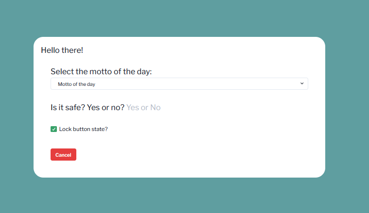

# The worstpractice.dev presents

## My useless React App

[](https://reactjs.org/)
[](https://devblogs.microsoft.com/typescript/announcing-typescript-4-8/)
[](https://webpack.js.org/)

The complete source code for the series of articles [My useless React App](https://worstpractice.dev/frontend/my-useless-react-app-1).

### Purpose

The only purpose is practicing:
* React, Typescript and Webpack working together
* keep coding standards
* write clean code
* write strict-typed code

### Installation

It's an `npm` application, so you need a `Nodejs` to run it. If you have it, then it doesn't matter if you are on Linux, 
OSX or Windows (WSL) just get to the terminal and type:

```shell
npm install
```

### Usage

There are three script commands added to `package.json`. Use them with the `npm run &lt;command&gt;`.

* `start` - This will build the application, handles the assets, open a browser window to check the application running and watches for code changes. Perfect setup for development.
* `build` - This will build the application for production. 
* `lint` - A basic check for errors in the sources.

